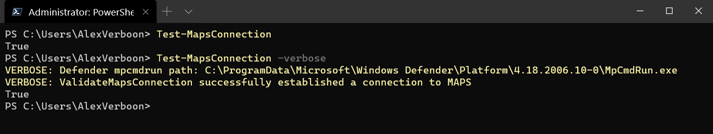

[](https://github.com/PowerShell/PowerShell) 
[](https://www.powershellgallery.com/packages/defendermaps) [](https://www.powershellgallery.com/packages/defendermaps)

# DefenderMAPS

DefenderMAPS provides functions to test Windows Defender MAPS connectivity

## Prerequisites

- Windows PowerShell 5.1 / PowerShell Core
- Windows 10 with Microsoft Defender enabled

## Getting Started

To get started with the module, open your PowerShell terminal and install the module from the PSGallery by running this simple command:

```powershell
Install-Module DefenderMAPS -Scope CurrentUser
```

## Test-MapsConnection

Use Test-MapsConnection to verify that your client can  communicate with the Windows Defender Antivirus cloud service.


<p align="center">
    
</p>


## More Information

* [Testing Windows Defender MAPS Connectivity with PowerShell](https://www.verboon.info/2019/07/testing-windows-defender-maps-connectivity-with-powershell/)
* [Microsoft Defender Antivirus (MDAV) “Cloud Protection” (Cloud-Delivered Protection aka MAPS)](https://yongrhee.wordpress.com/2020/04/11/microsoft-defender-antivirus-mdav-cloud-protection-cloud-delivered-protection-aka-maps/)
* [Configure and validate Microsoft Defender Antivirus network connections](https://docs.microsoft.com/en-us/windows/security/threat-protection/microsoft-defender-antivirus/configure-network-connections-microsoft-defender-antivirus)
